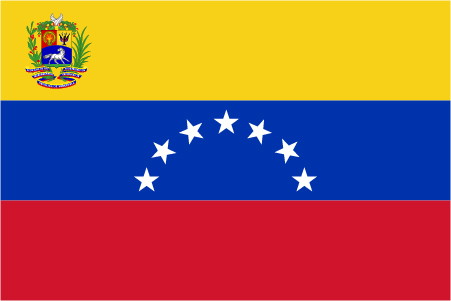

## Welcome to my GitHub Profile &nbsp;&nbsp;
 

&nbsp;&nbsp;&nbsp;&nbsp;&nbsp;&nbsp;&nbsp;
&nbsp;&nbsp;&nbsp;&nbsp;&nbsp;&nbsp;&nbsp;

  

<table align="right">
 <tr><td> English</a></td></tr>
 <tr><td> Spanish</a></td></tr>
</table>

Hi, I'm Margaret Rivas, a passionate third year cs and comp bio student @ FSU! I am currently working as a technology 
intern at Janssen (J&J) and a CS T.A. at FSU. 
 

💡 **Interested in:**  `Data Analytics 📊` `Full-stack dev 👨‍💻` `Automation 🚀` `System Design ⚙️` `Open Science 🧬` 

📫 **Reach me:** [margaretrivaslutz@hotmail.com](mailto:margaretrivaslutz@hotmail.com) | [mer20c@fsu.edu](mailto:mer20c@fsu.edu)

🌐 **Personal Website:** [margaretrl.github.io/home/](margaretrl.github.io/home/)

## My Skills 

&nbsp;
&nbsp;
&nbsp;
&nbsp;
&nbsp;
&nbsp;
&nbsp;
&nbsp;

&nbsp;
&nbsp;
&nbsp;

<!-- 
Cool resources:
How to make badges: https://javascript.plainenglish.io/how-to-make-custom-language-badges-for-your-profile-using-shields-io-d2aeaf016b6b
Amazing tool to edit gifs: https://ezgif.com/
-->

## My Coding Stats 📈

   
    

<!-- 

    <imr src="https://github-readme-stats.vercel.app/api/top-langs/?username=margaretrl&size_weight=0.5&count_weight=0.5"

-->

## 

Sign my guestbook? :D

